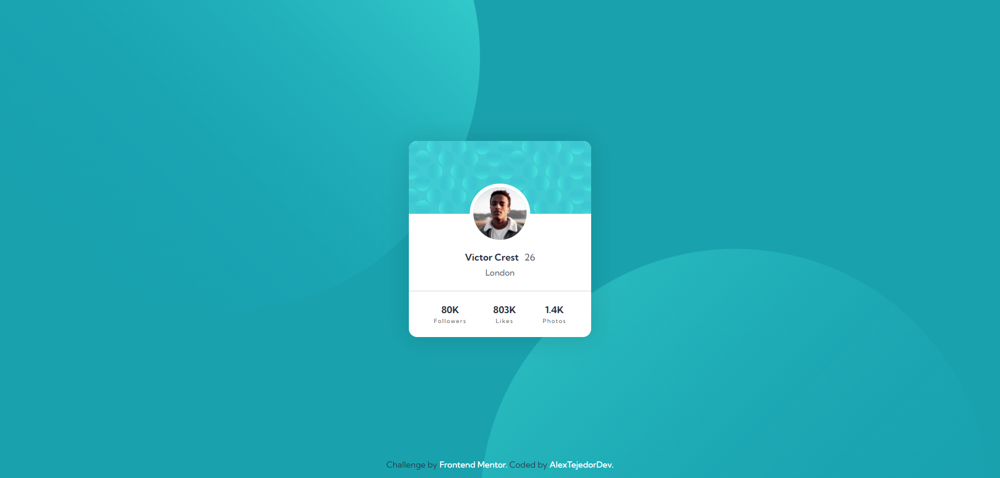

# Frontend Mentor - Profile card component solution

This is a solution to the [Profile card component challenge on Frontend Mentor](https://www.frontendmentor.io/challenges/profile-card-component-cfArpWshJ). Frontend Mentor challenges help you improve your coding skills by building realistic projects. 

## Table of contents

- [Overview](#overview)
  - [The challenge](#the-challenge)
  - [Screenshot](#screenshot)
  - [Links](#links)
- [My process](#my-process)
  - [Built with](#built-with)
  - [What I learned](#what-i-learned)
  - [Continued development](#continued-development)
  - [Useful resources](#useful-resources)
- [Author](#author)
- [Acknowledgments](#acknowledgments)

## Overview

### The challenge

- Build out the project to the designs provided

### Screenshot



### Links

- Solution URL: [GitHub Repo](https://github.com/AlexanderTejedor/Profile-card-component)
- Live Site URL: [GitHub Pages](https://alexandertejedor.github.io/Profile-card-component/)

## My process

### Built with

- Semantic HTML5 markup
- CSS custom properties
- Flexbox
- CSS Grid
- Mobile-first workflow

### What I learned

Super cool challenge! I actually had a lot of trouble positioning the two circles in the HTML. I looked for inspiration and even asked in forums until finally, in one of the other developers' challenges, I came across a comment by @danielmrz-dev as feedback to a developer. It surprised me; I didn't know you could put more than two images as a background and even position them from there. Here, I share the code snippet, and many thanks to @danielmrz-dev for that contribution!!!

```css
body{
    position: relative;
    background-color: var(--dark-cyan);
    background-image: url("./assets/images/bg-pattern-top.svg"), url("./assets/images/bg-pattern-bottom.svg");
    background-repeat: no-repeat, no-repeat;
    background-position: right 52vw bottom 35vh, left 48vw top 52vh;
}
```

### Continued development

Applying this new knowledge with the background game will be very helpful in improving and completing more challenges that require this type of solution.

### Useful resources

- [Google Fonts](https://fonts.google.com/) - This helped me to use external fonts instead of local ones, so that everyone can identify the type of font I used for this challenge.

## Author

- Website - [Alexander Tejedor](https://github.com/AlexanderTejedor)
- Frontend Mentor - [@AlexanderTejedor](https://www.frontendmentor.io/profile/AlexanderTejedor)
- Twitter - [@Alexand59894016](https://x.com/Alexand59894016)
- Instagram - [___.alexDev.___](https://www.instagram.com/___.alexdev.___/)

## Acknowledgments


Many thanks to @danielmrz-dev -[Daniel 🛸](https://www.frontendmentor.io/profile/danielmrz-dev) for the help with their comment!!
